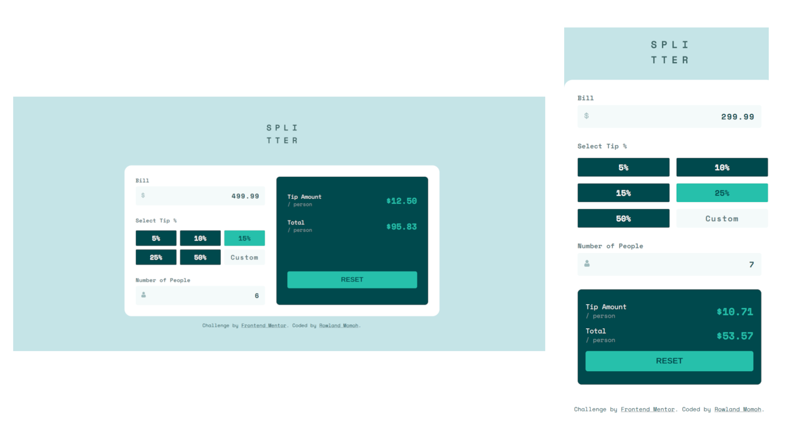

# Frontend Mentor - Tip calculator app solution

This is a solution to the [Tip calculator app challenge on Frontend Mentor](https://www.frontendmentor.io/challenges/tip-calculator-app-ugJNGbJUX). Frontend Mentor challenges help you improve your coding skills by building realistic projects.

## Table of contents

- [Overview](#overview)
  - [The challenge](#the-challenge)
  - [Screenshot](#screenshot)
  - [Links](#links)
- [My process](#my-process)
  - [Built with](#built-with)
  - [What I learned](#what-i-learned)
  - [Continued development](#continued-development)
  - [Useful resources](#useful-resources)
- [Author](#author)
- [Acknowledgments](#acknowledgments)

## Overview

### The challenge

Users should be able to:

- View the optimal layout for the app depending on their device's screen size
- See hover states for all interactive elements on the page
- Calculate the correct tip and total cost of the bill per person

### Screenshot

### Links

- Solution URL: [View here](https://www.frontendmentor.io/solutions/tip-calculator-WP92DAQ53t)
- Live Site URL: [View here](https://fe-tip-calculator.netlify.app/)

## My process

### Built with

- Semantic HTML5 markup
- CSS custom properties
- Flexbox
- CSS Grid
- Mobile-first workflow
- Vanilla JavaScript

### What I learned

I learnt more about HTML forms and form validation.

I also learnt more about JavaScript event listeners and DOM manipulations

### Continued development

I'll continue practicing to get better with JavaScript form validations and error handling and also get better with using CSS grid.

### Useful resources

- [MDN web docs](https://developer.mozilla.org/en-US/docs/Web/API/EventTarget/addEventListener) - This helped me understand event handlers in JavaScript better
- [FreeCodeCamp](https://www.freecodecamp.org/news/dom-manipulation-in-javascript/) - This is an amazing article which helped me finally understand DOM traversals and manipulations

## Author

- Website - [Rowland Momoh](https://rowland-momoh.netlify.app/://www.your-site.com)
- Frontend Mentor - [@rowleks](https://www.frontendmentor.io/profile/rowleks)
- Twitter - [@Rolexks](https://x.com/Rolexks)

## Acknowledgments

I'm grateful to frontend mentor for this challenge as it helps build my web development skills further. I also thank google, w3school, freeCodeCamp, MDN web docs and other similar sites for their amazing and helpful resources.
